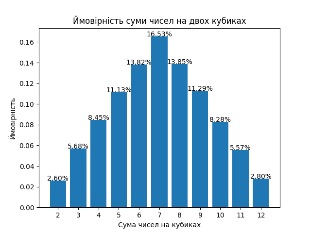

# Моделювання кидання двох кубиків методом Монте-Карло

## Опис завдання
Алгоритм імітує велику кількість кидків двох кубиків, обчислює суму чисел на кубиках та визначає ймовірність випадання кожної можливої суми (від 2 до 12).  
Метод Монте-Карло дозволяє наближено оцінити розподіл ймовірностей через випадкові симуляції.

## Аналітичні ймовірності
Таблиця ймовірностей сум при киданні двох кубиків виглядає наступним чином:

| Сума | Ймовірність |
|------|-------------|
| 2    | 2.78% (1/36) |
| 3    | 5.56% (2/36) |
| 4    | 8.33% (3/36) |
| 5    | 11.11% (4/36) |
| 6    | 13.89% (5/36) |
| 7    | 16.67% (6/36) |
| 8    | 13.89% (5/36) |
| 9    | 11.11% (4/36) |
| 10   | 8.33% (3/36) |
| 11   | 5.56% (2/36) |
| 12   | 2.78% (1/36) |

## Графіки результатів Монте-Карло

### 100 кидків

### 1000 кидків

### 10000 кидків

### 100000 кидків

## Результати Монте-Карло та теоретичні розрахунки

| Сума | 100 кидків  | 1000 кидків| 10000 кидків  | 100000 кидків | аналітичні розрахунки |
|------|-------------|------------|---------------|----------------|-------------|
| 2    | 3.00%       | 3.30%      | 2.93%         | 2.60%          | 2.78% |
| 3    | 9.00%       | 5.30%      | 5.83%         | 5.68%          | 5.56% |
| 4    | 7.00%       | 7.60%      | 8.06%         | 8.45%          | 8.33% |
| 5    | 11.00%      | 12.50%     | 11.38%        | 11.13%         | 11.11% |
| 6    | 8.00%       | 14.50%     | 14.27%        | 13.82%         | 13.89% |
| 7    | 21.00%      | 16.20%     | 15.90%        | 16.53%         | 16.67% |
| 8    | 5.00%       | 13.80%     | 13.46%        | 13.85%         | 13.89% |
| 9    | 17.00%      | 10.70%     | 10.92%        | 11.29%         | 11.11% |
| 10   | 8.00%       | 7.40%      | 8.53%         | 8.28%          | 8.33% |
| 11   | 5.00%       | 6.00%      | 5.80%         | 5.57%          | 5.56% |
| 12   | 6.00%       | 2.70%      | 2.92%         | 2.80%          | 2.78% |

## Висновки
- Зі збільшенням кількості кидків результати методу Монте-Карло збігаються з аналітичними значеннями.  
- Для невеликої кількості експериментів (100, 1000) спостерігаються помітні відхилення через випадковість.  
- При 100000 кидках результати практично ідентичні теоретичним, що підтверджує правильність симуляції та дію закону великих чисел
